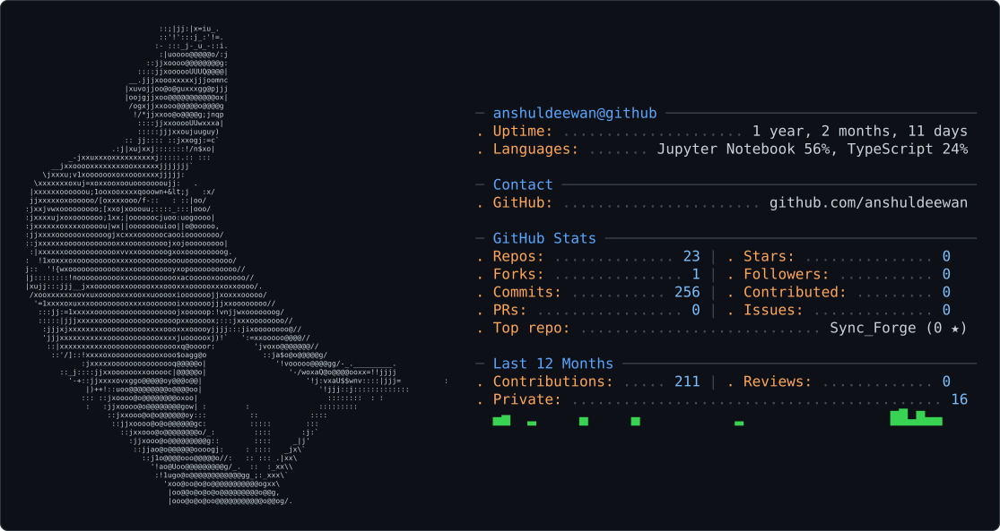

<picture>
  <source media="(prefers-color-scheme: dark)" srcset="dark_mode.svg" />
  <source media="(prefers-color-scheme: light)" srcset="light_mode.svg" />
  
</picture>

  

<h3 align="center">Building data-driven solutions at the intersection of Software Engineering, AI & Finance</h3>

  
  
  

---

### 🚀 About Me

- 🎓 **Education**: B.Tech in Computer Science and Engineering @ **Vellore Institute of Technology (VIT)** *(CGPA: 7.87)*
- 📊 **Quant Analytics**: Market Analyst Intern @ **Axxela Research & Analytics** (Mumbai) — Monitored 5 commodity futures markets (Live Cattle, Feeder Cattle, Lean Hogs, Gold, Silver); built Python quantitative dashboards applying Z-Score, Beta regression, and rolling volatility.
- 💻 **Full-Stack & GenAI**: Remote Tech Intern @ **Aletheions** — Built React.js & Tailwind CSS production interfaces, integrated REST APIs, and leveraged Generative AI to accelerate SDLC by 45%.
- 🏆 **Anthropic AI Specialist**: Completed 12+ certification modules covering Claude Code, Model Context Protocol (MCP), AI Agents, Subagents, Vertex AI, and Bedrock. Verified at [`github.com/anshuldeewan/Anthropic_Cerificates`](https://github.com/anshuldeewan/Anthropic_Cerificates).
- 📍 **Location**: Jaipur, Rajasthan, India

---

### 🚀 Latest Builds

| Build | What makes it interesting | Links |
| :--- | :--- | :--- |
| **SyncForge** | Real-time collaborative engineering workspace with local-first editing, CRDT persistence, RBAC, and AI knowledge retrieval. | [Source](https://github.com/anshuldeewan/SyncForge) |
| **ThesisOS** | Human-in-the-loop multi-agent financial research system for debate-driven analysis and executive memo generation. | [Live Demo](https://thesis-os-ochre.vercel.app) · [Source](https://github.com/anshuldeewan/ThesisOS) |
| **DocuMind Advanced RAG** | Multimodal document intelligence for PDFs, spreadsheets, images, and code with a Dockerized FastAPI + ChromaDB backend. | [Live Demo](https://docu-mind-advanced-rag.vercel.app) · [Source](https://github.com/anshuldeewan/DocuMind-Advanced-RAG) |
| **LE Spread Analyzer** | CME Live Cattle calendar-spread research with dynamic hedge ratios, cointegration, mean reversion, and backtesting. | [Source](https://github.com/anshuldeewan/LE-Spread-Analyzer) |
| **anshul-quantfin** | Python package for mathematical finance, stochastic modeling, and derivatives pricing engines. | [PyPI](https://pypi.org/project/anshul-quantfin/) · [Source](https://github.com/anshuldeewan/anshul-quantfin) |

---

### 🛠️ Tech Stack & Arsenal

| Category | Technologies & Tools |
| :--- | :--- |
| **Languages** | `Python` · `JavaScript (ES6+)` · `TypeScript` · `SQL` · `Bash` |
| **Frontend** | `React.js` · `Next.js 16` · `Tailwind CSS` · `HTML5 / CSS3` · `Framer Motion` |
| **Backend & APIs** | `Flask` · `Node.js` · `REST APIs` · `Supabase RLS` |
| **Data & AI/ML** | `Generative AI` · `Prompt Engineering` · `Scikit-Learn` · `Pandas` · `NumPy` · `MCP` |
| **Quant Trading** | `Futures Spread Trading` · `Butterfly (D-Fly)` · `Z-Score Analysis` · `Trading Tech (TT)` |
| **Databases & Cloud** | `PostgreSQL` · `MySQL` · `SQLite` · `Supabase` · `Vercel` · `Git / GitHub` |

 

  

---

### 📂 Featured Projects

| Project | Tech Stack | Highlights | Links |
| :--- | :--- | :--- | :--- |
| 💧 **RidePlus RO Purifier** | `React.js` · `Tailwind` · `Supabase` · `Vercel` | Full-stack booking platform with RBAC Admin Panel, dynamic SEO slugs, multi-image upload, and +45% GenAI dev boost. | [Repo](https://github.com/anshuldeewan/RideplusRO.git) · [Live Site](https://rideplusro.com/) |
| 🤖 **UPI Risk Predictor** | `Python` · `Scikit-Learn` · `Flask` · `Pandas` | ML fraud classification system trained on 10,000+ transaction records. Achieved 92% Accuracy, 90% Precision, and 88% Recall. | [Repo](https://github.com/anshuldeewan/UPI-Risk-Predictor.git) |
| 🛡️ **Anthropic AI Suite** | `Claude Code` · `MCP` · `AI Agents` | 12+ Anthropic AI certification modules covering Claude API, Subagents, Agent Skills, Vertex AI, and Bedrock. | [Repo](https://github.com/anshuldeewan/Anthropic_Cerificates) |

---

### 🏆 Certifications & Specializations

| Certificate Suite | Issuer | Completed Modules / Focus | Verification Link |
| :--- | :--- | :--- | :--- |
| 🤖 **Anthropic AI Specialization (12+ Modules)** | Anthropic | `Claude 101` · `Claude Code` · `Claude Platform` · `Claude API` · `Claude Cowork` · `Model Context Protocol (MCP)` · `AI Agents` · `Subagents` · `Agent Skills` · `Google Vertex AI` · `Amazon Bedrock` · `AI Fluency` | [📜 Verify Repo](https://github.com/anshuldeewan/Anthropic_Cerificates) |
| 📊 **Quantitative Analytics & Futures Trading** | Axxela Research | Commodity Spread Trading · Butterfly (D-Fly) Strategies · Z-Score & Beta Regression · Algorithmic Order Monitoring | [💼 Internship Proof](https://anshul-deewan.vercel.app/#education) |
| 💻 **Full-Stack Engineering & GenAI SDLC** | Aletheions | React.js · Tailwind CSS · REST API Integration · GenAI Prompt Engineering & Development Acceleration | [🌐 Live Site](https://anshul-deewan.vercel.app/#projects) |

 

  
  
  
  
  

---

  ⚡ <i>"Architecting data-driven systems at the intersection of Software Engineering, AI & Finance"</i> ⚡

